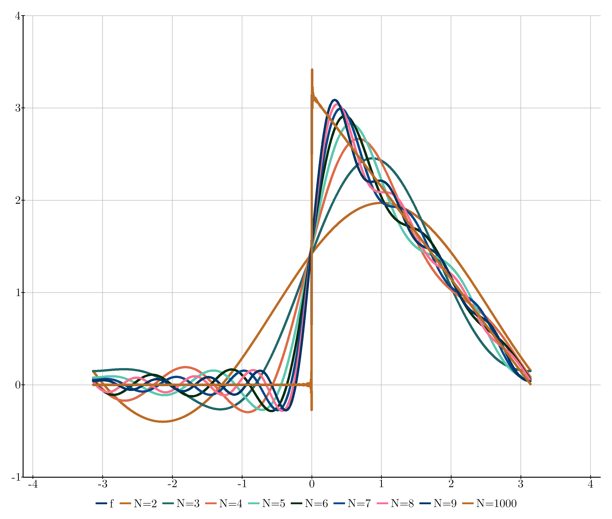
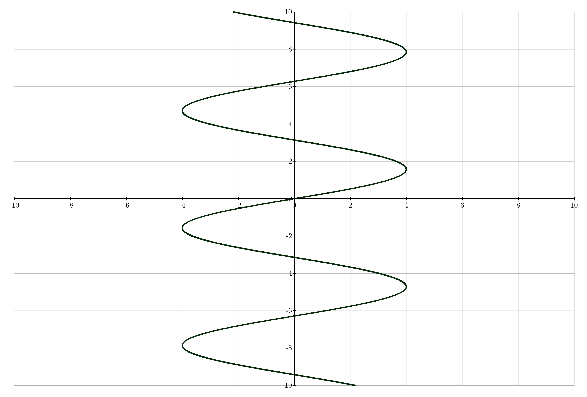

# Kaxe

Kaxe is an lightweight graphing tools for functions, equations, points and more written in pure python



## Plots

Kaxe supports diffrent plotting windows including

* A standard basis plotting window
* Logaritchmic plot
* Polar plot
* Box plot

Kaxe is build to be simple, flexiable and equipped with an flat learning curve.

## Gettings started

To get started create a plot object

```python
import kaxe

plt = kaxe.Plot(window:list)

plt.save("plot.png")
```



Alternatively other windows can be used

#### Polarplot
```python
kaxe.PolarPlot(window:list)
```


#### Box plot
```python
kaxe.BoxPlot(window:list)
```

#### Box plot
```python
plt = kaxe.LogPlot(window:list, firstAxisLog:bool=False, secondAxisLog:bool=True)
```

## Adding objects to window

Adding objects to a window is as easy as
```python
plt.add(obj:object)
```

## Objects

Kaxe supports diffrent objects 

To add a legend for any object do the following
```python
obj.legend(text)
```

### Function

```python
kaxe.Function(f:FunctionType, 
    color:tuple=None, 
    width:int=10,
    *args, 
    **kwargs
)
```

To add a fill under a graph use the fill method 
```python
Function.fill(x0, x1)
```

To add a tangent to the function use the tangent method
```python3
Function.tangent(x0)
```


### Points

Points in two lists x and y can be added to windows using

```python
kaxe.Points(
    x:list|tuple, 
    y:list|tuple, 
    color:tuple, 
    size:int, 
    symbol:str=symbols.CIRCLE, 
    connect:bool=False
)
```


### Equation

Equations can be expressed as to functions 

```python
kaxe.Equation(
    left:FunctionType, 
    right:FunctionType, 
    color:tuple,
    width:int
)
```

E. g
```python
kaxe.Equation(lambda x,y: 2*x, lambda x,y: y)
```


## Styling

For styles avaliable use 
```python
plot.help()
```

For setting a style use
```python
plot.style({"Marker.showLine":False}, width=2000)
```

Or use a predetermined theme with
```python
plot.theme(kaxe.themes.A4Half)
```

Axis titles can be changed with
```python
plot.title(*titles:str)
```
