# Kaxe

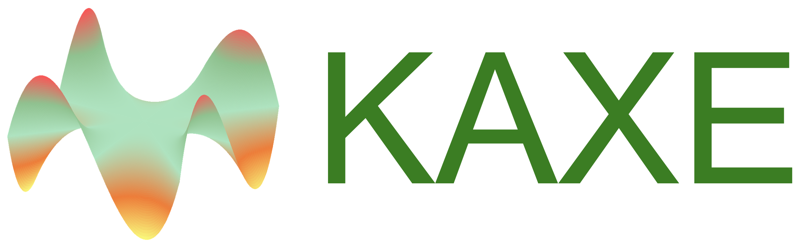

Kaxe is a lightweight, pure-Python plotting library for publication-quality figures in LaTeX documents. Create plots and charts with a simple object-oriented API, style them for A4 pages, and export to PNG or SVG.

Documentation: [kaxe.readthedocs.io](https://kaxe.readthedocs.io/en/latest/)

## Installation

```bash
pip install kaxe          # 2D plotting (default)
pip install kaxe[3d]        # add 3D plotting (OpenGL)
pip install kaxe[pdf]       # add PDF export
pip install kaxe[3d,pdf]    # 3D + PDF
```

## Quick example

```python
import kaxe

plt = kaxe.Plot([-5, 5, -5, 5])
plt.add(kaxe.Function2D(lambda x: x**2 - 4))
plt.add(kaxe.Points2D([1, 2, 3], [1, 4, 9]))
plt.theme(kaxe.Themes.A4Medium)
plt.title("$x^2 - 4$")
plt.save("figure.png")
plt.save("figure.svg")
```

See the [getting started guide](https://kaxe.readthedocs.io/en/latest/pages/start.html), [recipes](https://kaxe.readthedocs.io/en/latest/pages/recipes.html), [styling guide](https://kaxe.readthedocs.io/en/latest/pages/styling.html), and [export guide](https://kaxe.readthedocs.io/en/latest/pages/export.html) for the full API.

## Goals

Kaxe was made to create simple, aesthetic graphs for articles, reports, and other academic work in LaTeX:

* Plots that fit the look of LaTeX documents (Computer Modern math via [fondi](https://github.com/valteryde/fondi))
* A straightforward object-oriented interface: create a window, add objects, style, save

## Examples of plots

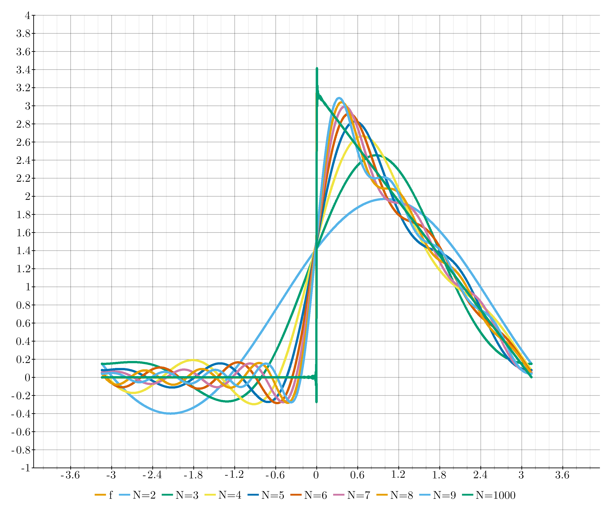
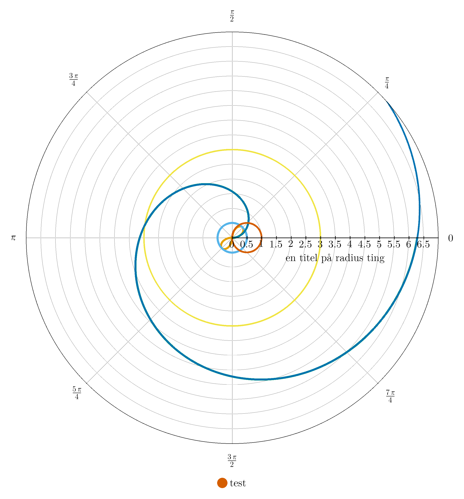
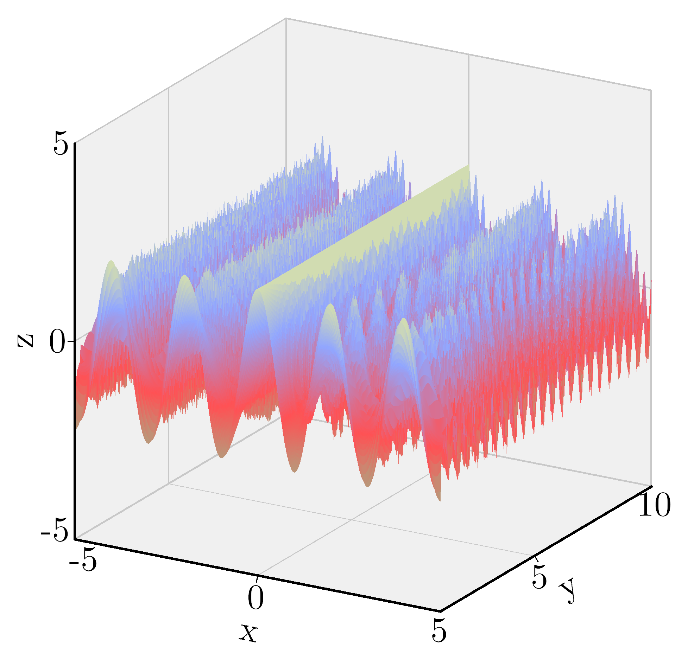
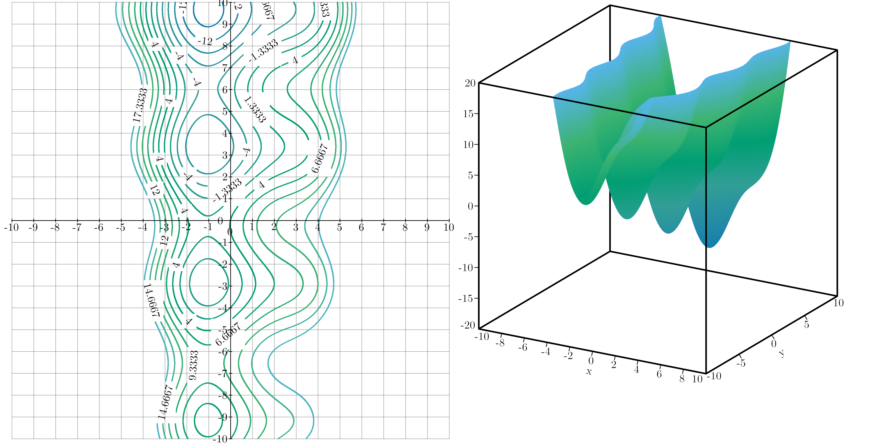
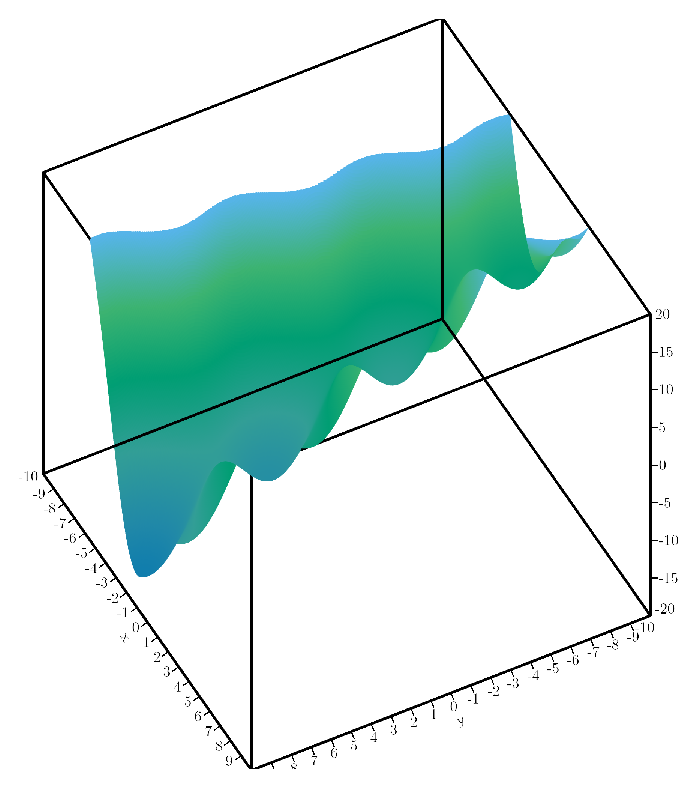
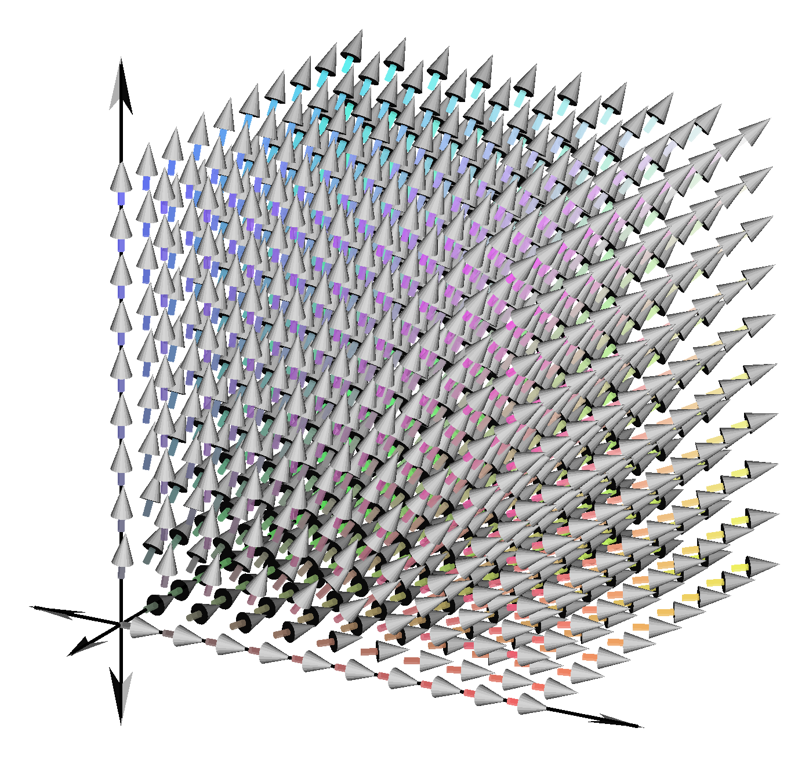
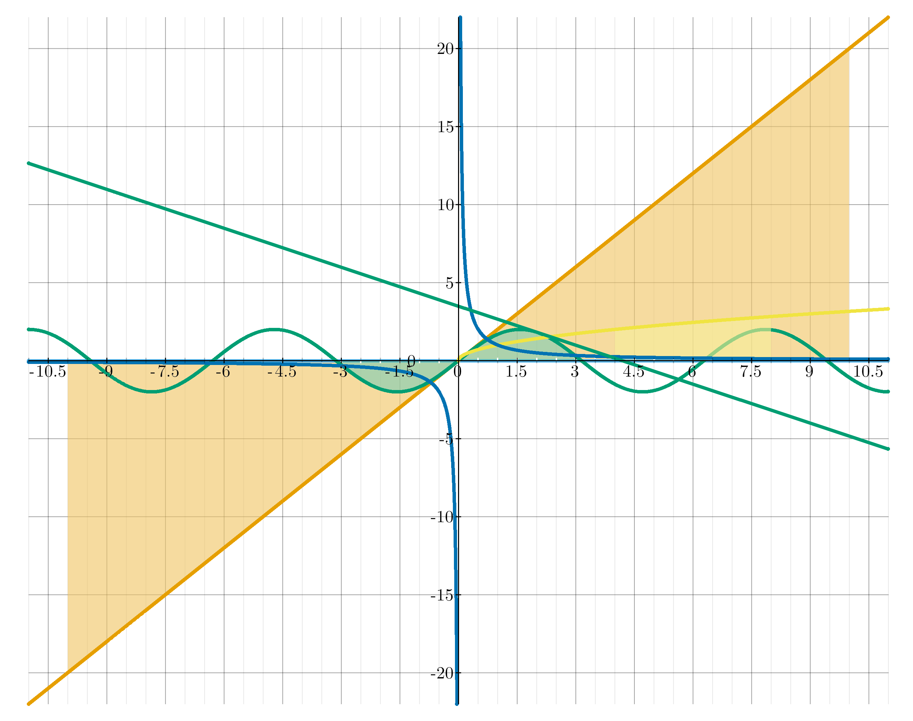
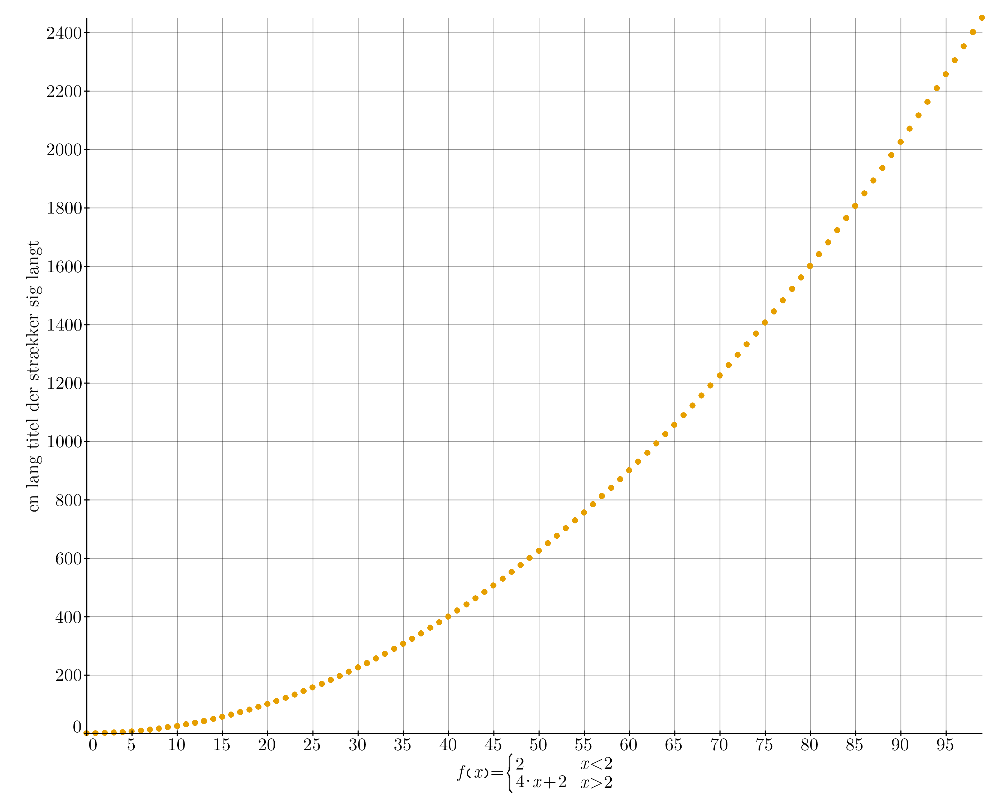
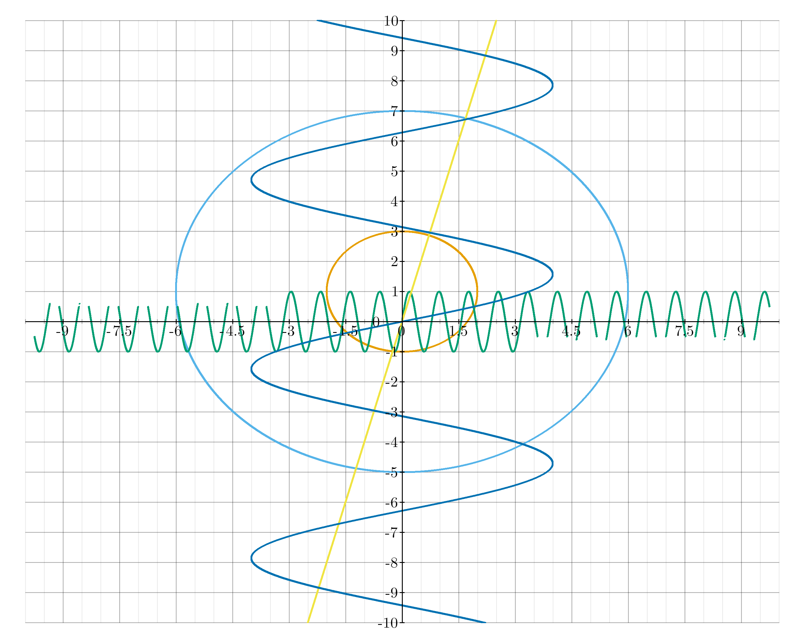
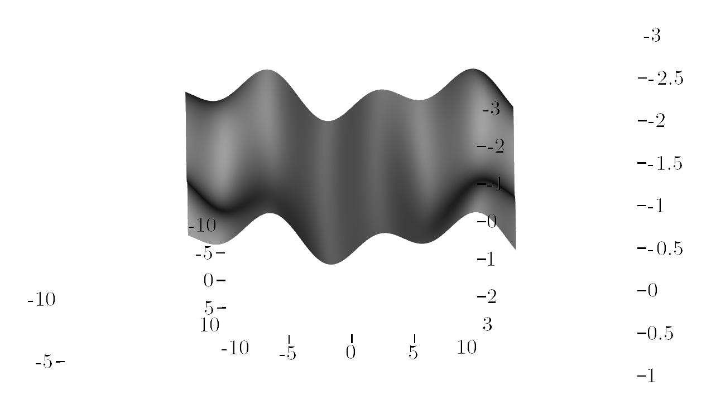
