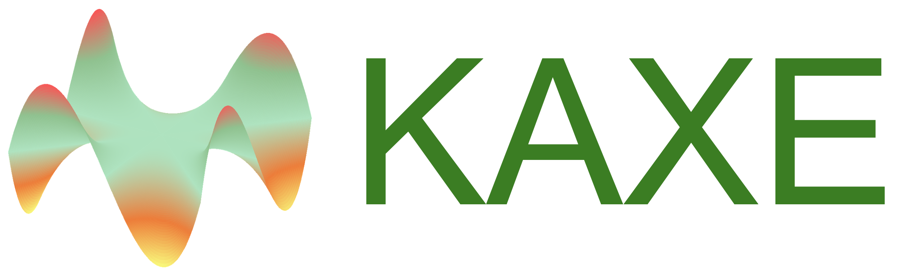
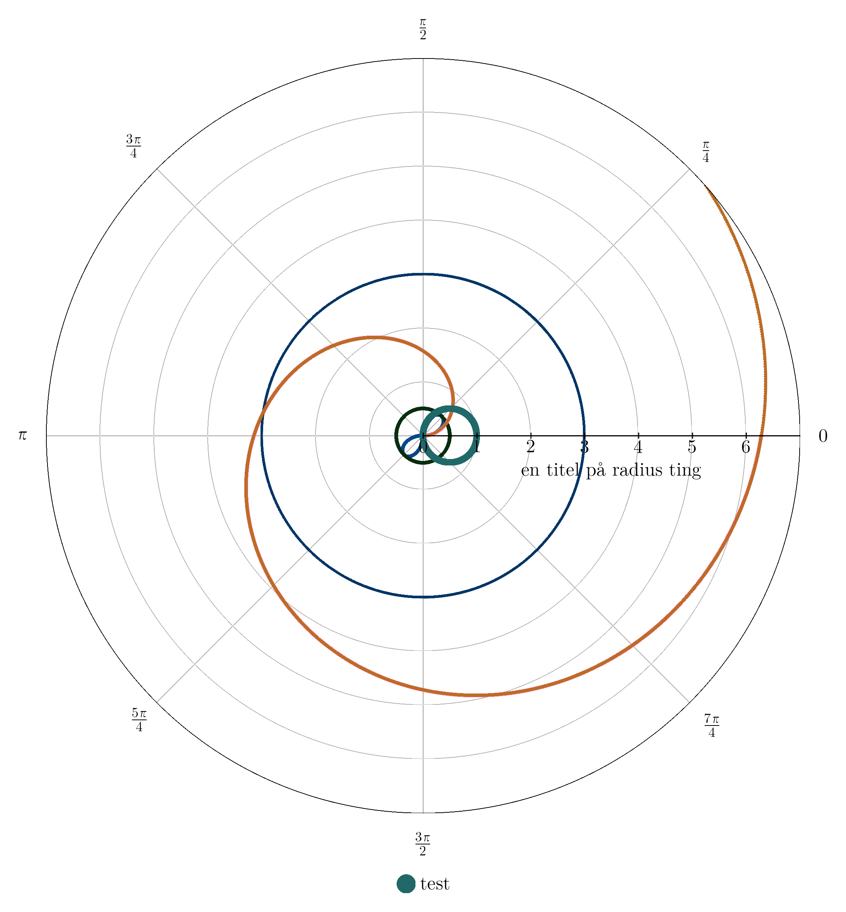
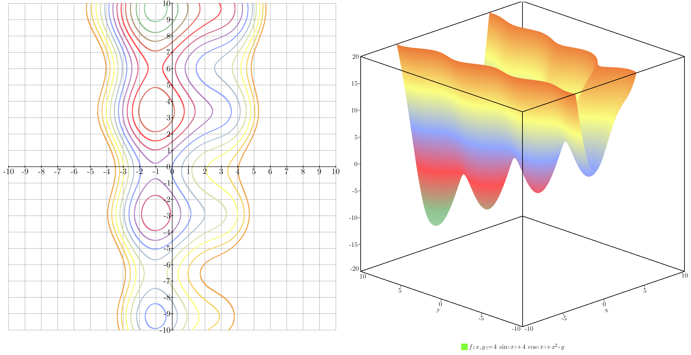
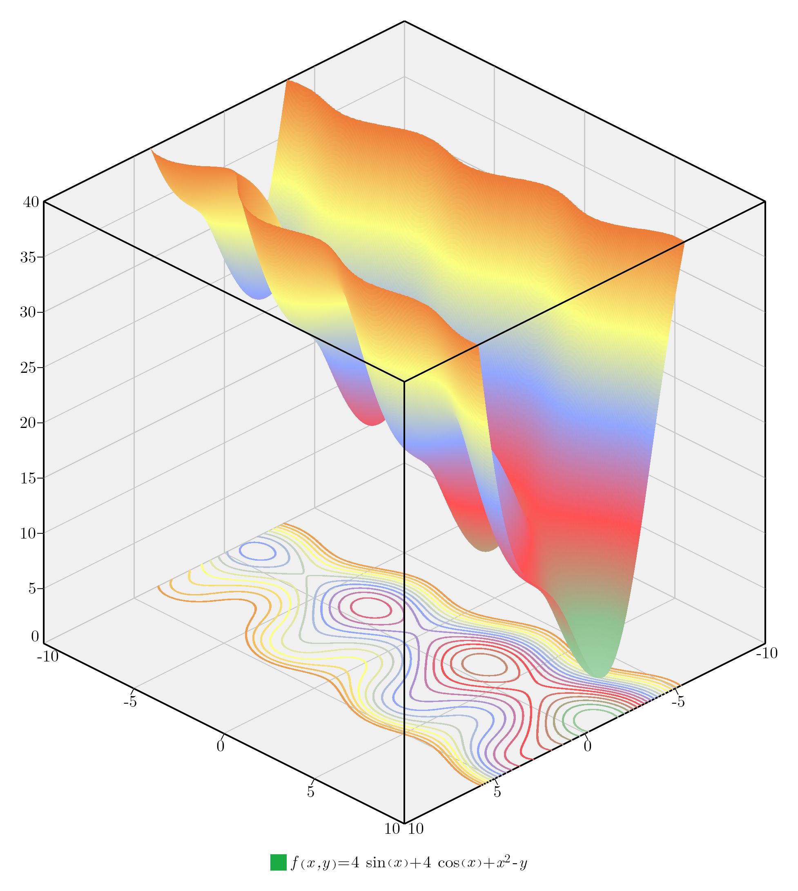
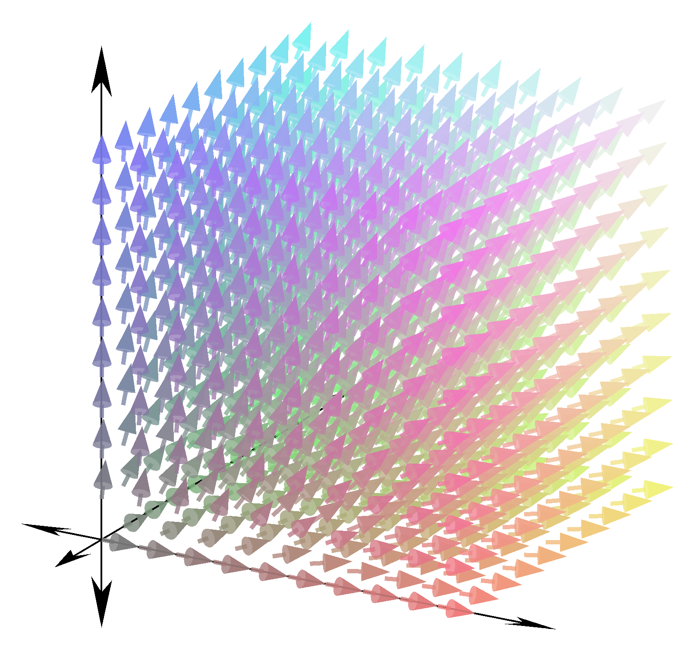
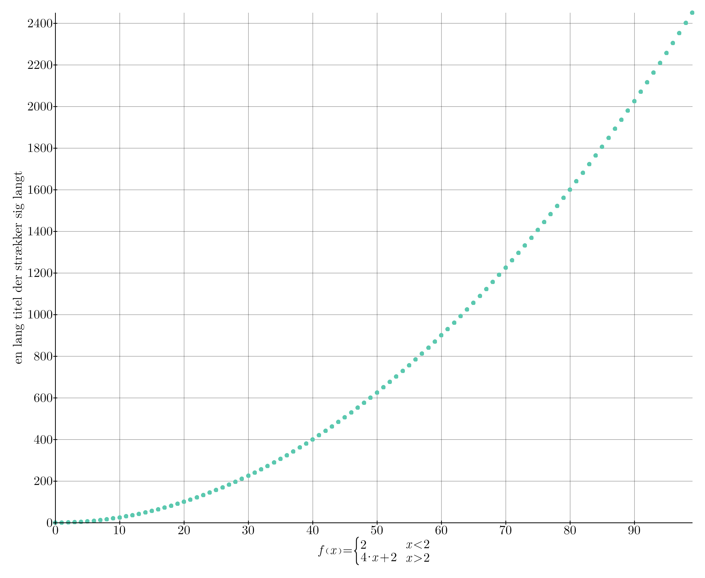
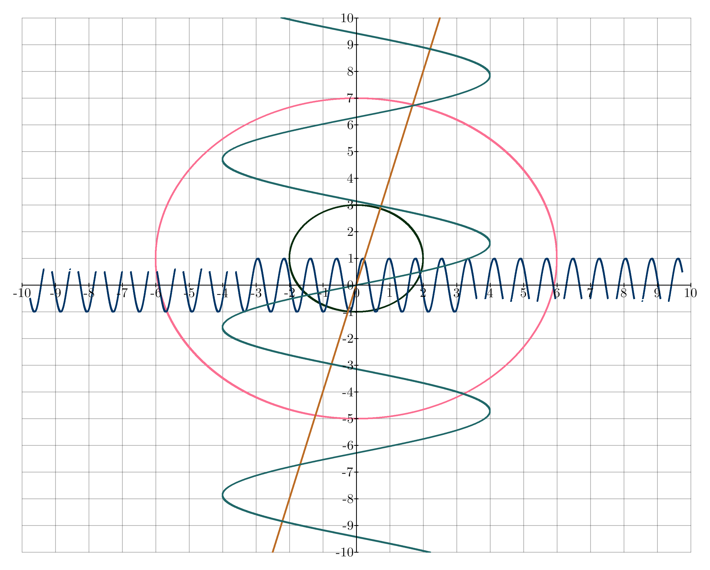
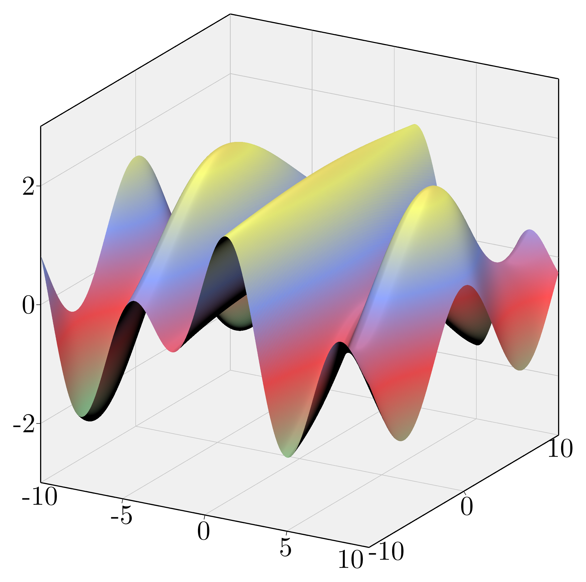

# Kaxe

Kaxe is an lightweight graphing tools for functions, equations, points and more written in pure python. Kaxe supports various plotting windows and charts.

Kaxe documentation can be found [here](https://kaxe.readthedocs.io/en/latest/)

## Goals

Kaxe was made to create pretty, simple and easy graphs to be used along side articels, repports and other Acedima made in LaTeX. The goals for Kaxe then became

* Create pretty plots thats fit into the astectic of LaTeX
* A very simple object oriented interface

To get started visit [the getting started section](https://kaxe.readthedocs.io/en/latest/pages/start.html)

## Examples of plots

