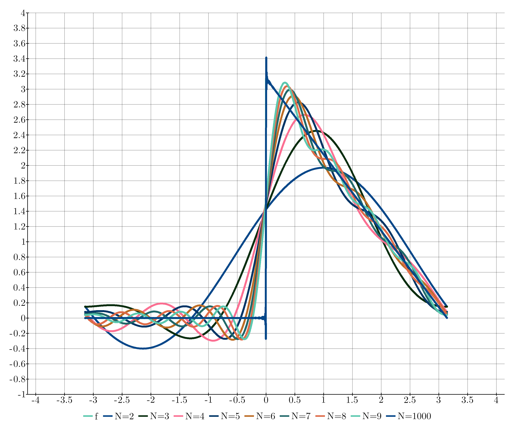
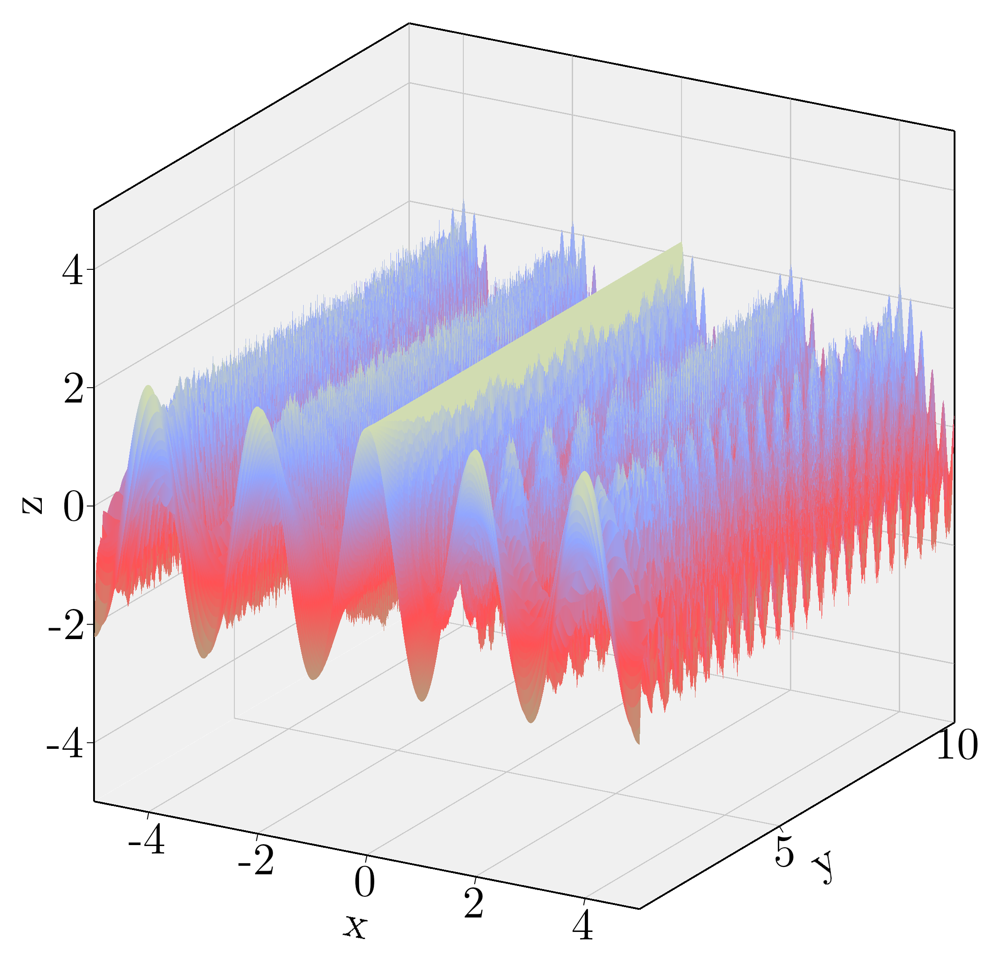
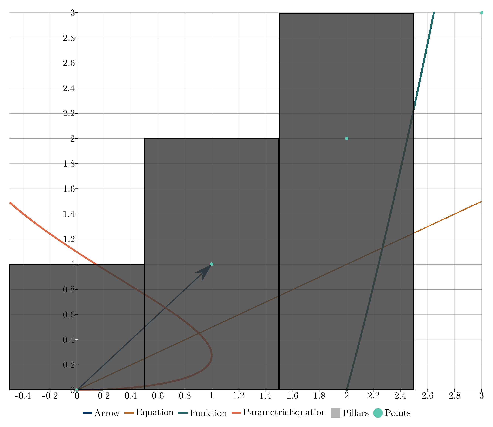
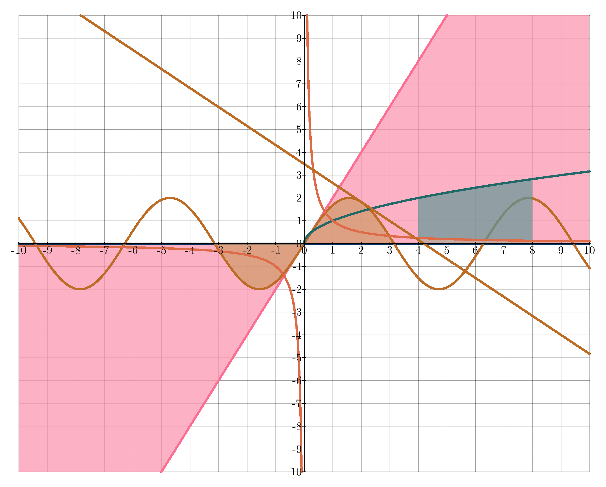

# Kaxe


Kaxe is an lightweight graphing tools for functions, equations, points and more written in pure python. Kaxe supports various plotting windows and charts.

Kaxe documentation can be found [here](https://kaxe.readthedocs.io/en/latest/)

## Goals

Kaxe was made to create pretty, simple and easy graphs to be used along side articels, repports and other Acedima made in LaTeX. The goals for Kaxe then became

* Create pretty plots thats fit into the astectic of LaTeX
* A very simple object oriented interface

## Examples of plots

2D Plots


Polar plots


3D Plots


Grids


## Preview of Code

To get started create a plot object

```python
import kaxe

plt = kaxe.Plot()
plt.add( ... ) # Object to be added
plt.save("plot.png")
```

This is all you need for a plot and some objects. To get started visit [the getting started section](https://kaxe.readthedocs.io/en/latest/pages/start.html)





